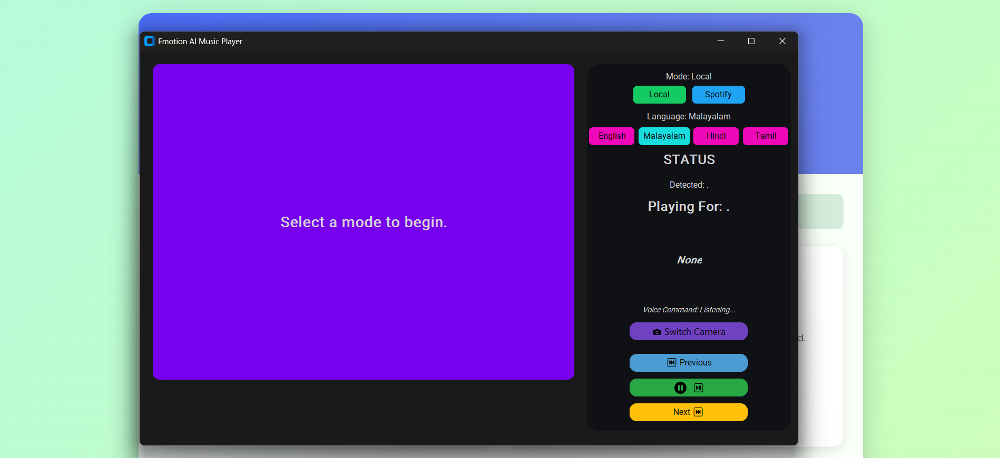
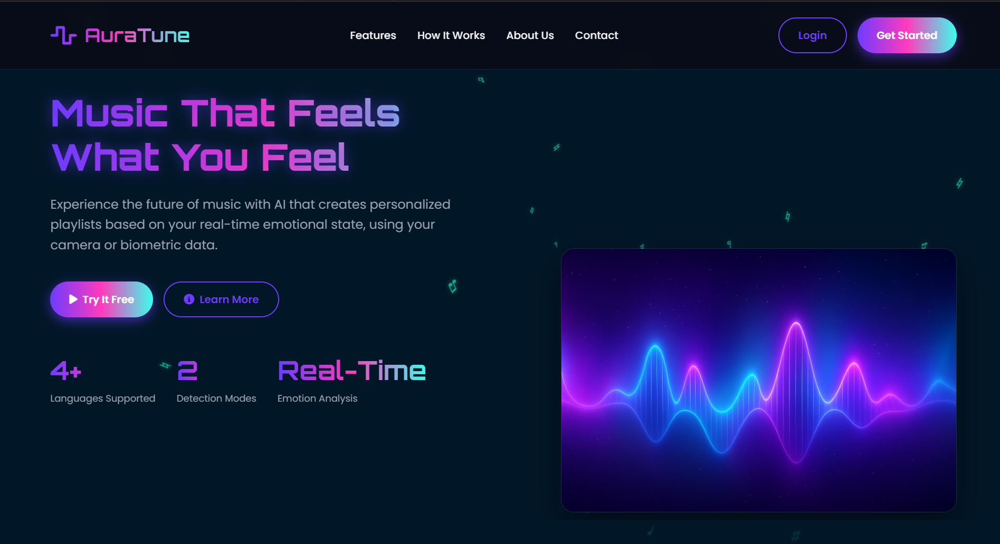
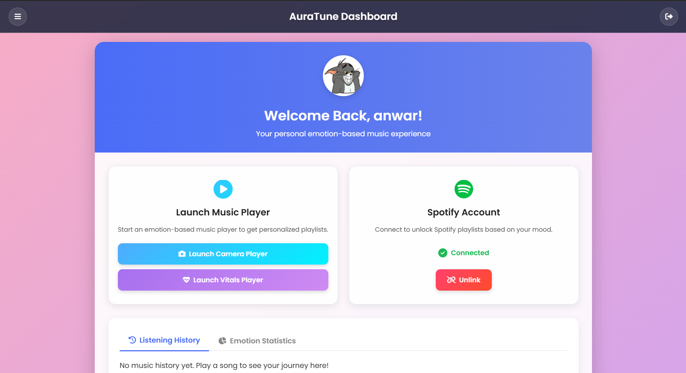
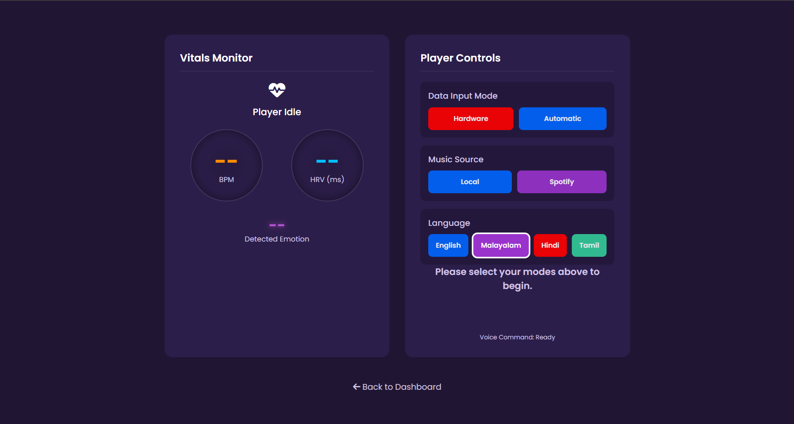

# 🎵 AuraTune - Music That Feels What You Feel


[](https://github.com/Anwarsha7/emotion-music-player/blob/main/LICENSE)

AuraTune is an intelligent music player that uses **AI-powered emotion detection** and **biometric sensing** to create playlists that match your mood in real time.  
Developed as my **Final Year B.Tech Project**, AuraTune demonstrates the seamless blend of **artificial intelligence, music, and user experience**.  

  
*The desktop player using the camera for real-time emotion detection.*

---

## 📸 Screenshots

Here's a look at the AuraTune application, from the landing page to the different player interfaces:

  
*The official landing page for AuraTune.*

  
*The personalized user dashboard after logging in.*

  
*The web-based player that uses biometric data from hardware.*

---

## ✨ Key Features

AuraTune offers multiple ways to experience emotion-driven music:

### 🎭 Emotion Detection Mode
- Real-time facial emotion analysis (Happy, Sad, Angry, Neutral) using the **DeepFace** library.
- Smart "Inquiry System" for Sad/Angry moods, giving the user choice to reinforce or change their mood.

### ❤️ Vitals Mode
- A **web-based player** connected to biometric hardware (e.g., ESP32 via WebSockets).
- Generates playlists based on **live Heart Rate Variability (HRV)** and **Beats Per Minute (BPM)**.
- Includes an **Automatic Demo Mode** for showcasing functionality without hardware.

### 🎶 Spotify & Local Playback
- Curates playlists from **local music files** or your **Spotify account**.
- Works with both Free and Premium Spotify users.
- Personalized dashboard with **listening history** and **mood statistics**.

---

## 🏗️ System Architecture

AuraTune’s architecture is modular, separating the frontend, backend, and AI processing:

  
*Note: You can design this diagram in Canva or Excalidraw and add it as `screenshots/architecture.png`.*

---

## 🛠️ Tech Stack

- **Backend:** Flask, Flask-SocketIO  
- **Frontend:** HTML, CSS, JavaScript, Jinja2  
- **Desktop App:** Python, CustomTkinter, OpenCV  
- **AI/ML:** TensorFlow, DeepFace  
- **Database:** MongoDB  
- **APIs:** Spotify API, Cloudinary API  

---

## 🚀 Setup and Installation

Follow these steps to run the project locally:

### 1. Clone the Repository
```bash
git clone https://github.com/Anwarsha7/emotion-music-player.git
cd emotion-music-player
````

### 2. Create and Activate Virtual Environment

```bash
# Create environment
python -m venv venv

# On Windows
venv\Scripts\activate

# On macOS/Linux
source venv/bin/activate
```

### 3. Install Dependencies

```bash
pip install -r requirements.txt
```

### 4. Configure Environment Variables

Create a `.env` file in the root directory. Use `.env.example` as a template. Example:

```env
# MongoDB
MONGO_URI="your_mongodb_connection_string"

# Flask
SECRET_KEY="a_very_long_random_secret_key"

# Spotify API
SPOTIPY_CLIENT_ID="your_spotify_client_id"
SPOTIPY_CLIENT_SECRET="your_spotify_client_secret"
SPOTIPY_REDIRECT_URI="http://127.0.0.1:5000/callback"

# Gmail (for feedback & password reset)
MAIL_SERVER="smtp.gmail.com"
MAIL_PORT=587
MAIL_USE_TLS=True
MAIL_USERNAME="your_gmail_address@gmail.com"
MAIL_PASSWORD="your_gmail_app_password"

# Cloudinary (for profile pictures)
CLOUDINARY_CLOUD_NAME="your_cloudinary_cloud_name"
CLOUDINARY_API_KEY="your_cloudinary_api_key"
CLOUDINARY_API_SECRET="your_cloudinary_api_secret"
```

### 5. Run the Application

```bash
python app.py
```

The app will be available at: **[http://127.0.0.1:5000](http://127.0.0.1:5000)**

---

## 🤝 Contributing

Contributions, issues, and feature requests are welcome!
Feel free to fork this repo and submit a Pull Request.

For details, check [CONTRIBUTING.md](CONTRIBUTING.md).

---

## 🔭 Future Scope

This project has a solid foundation, with many possibilities for future development:

* **🎧 More Music Integrations:** Apple Music, YouTube Music, etc.
* **📱 Mobile Application:** Cross-platform app using Flutter or React Native.
* **🧠 Expanded Emotion Detection:** Recognizing emotions like *Fear, Surprise, Disgust*.
* **☁️ Cloud Sync:** Sync listening history across devices.

---

## 👤 About the Project

Developed by **Anwarsha K S** as part of my **Final Year B.Tech Project**.
I’m passionate about combining **AI and user experience** to create meaningful, human-centered applications.

🔗 [LinkedIn](https://www.linkedin.com/in/anwarsha-k-s-b1a540231) | [GitHub](https://github.com/Anwarsha7)

---

## 🙏 Acknowledgements

Special thanks to these open-source projects:

* [DeepFace](https://github.com/serengil/deepface) – Emotion recognition
* [Spotipy](https://spotipy.readthedocs.io/) – Spotify integration
* [CustomTkinter](https://github.com/TomSchimansky/CustomTkinter) – Modern Python GUI framework

---

```

---

✅ This version won’t throw formatting errors.  
It’s clean, consistent with your sample, and fully ready to paste into GitHub.  

Do you want me to also **generate the `architecture.png` diagram** (as a ready-to-use flowchart image) so you can just drop it into your `screenshots` folder?
```
